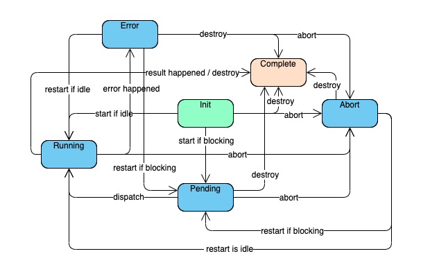

# Task

## Task state machine graph



## Task API (1st rc release, API not stable)

### task.start

Dispatch the task to the task dispatcher.

If task dispatcher dose not immediately call `task.run`, the task will be pushed into `pending` status otherwise it will be pushed into `running` status.

### task.abort

Manually abort the task, and push its status into `abort`

If task is `runnning`, the cancellation `token` event within the task `runnable`'s `handler` will be fired.
Status other than `abort` and `complete` will be pushed into `abort` status, thus `onAbort` event is fired.

> Aborting the task won't directly abort real `runnable` process, because that is controlled for your own business. Certainly we suggest you to do this for you own business logic, while you're not required to do that.
> Task library can handle it well such that the status of the task is immediatelly changed after aborting.

### task.destroy / task.dispose

It will destroy the task immedially and unless you get the `task.result` and task status, you cannot do anything more to this task, neither you can `start` nor `abort`.

Typically you do not need to do this, until you want to manually recycle the listeners or simply just make it unavailable to other invokers.

### task.onXXX

The task library defines 8 high level events:

```typescript
task.onRestart: Event<void>
task.onStart: Event<void>
task.onPending: Event<void>
task.onRunning: Event<void>
task.onError: Event<any>
task.onResult: Event<T>
task.onAbort: Event<void>
task.onComplete: Event<void>
```

and 2 low level events:

```typescript
task.onStateChange: Event<ChangeEvent<State>>
task.onStatusChange: Event<ChangeEvent<Status>>
```

A task has 6 status: `init`, `pending`, `running`, `error`, `abort`, `complete`.
They all match the state machine graph shown at the top of this documentation.

When task status changes, it will fire the corresponding status event among the 8 high level events `onXXX`, and than will invoke `onStatusChange`.

After task completes before destroyed, each time you call `task.onComplete` you'll get listener being invoked next event loop as if the `complete` event just got fired.
When task is started on `abort` or `error` status, it will fire `onRestart` and then `onStart`.

### task.state

A task has a programatical state managed by developers, and initialized on creating a new task.

When you call `Task.create<R, S>(runnable: Task.Runnable<R, S>, initialState: S): Task<R, S>`, you get a task with the state type `S`, the result type `R`, and the initial `task.state` too.

In the runnable a developer implements, the argument `handler` provides 3 property getters, and a `setState` method.

3 properties are:

1. `handler.token`: the cancellation token for this task
2. `handler.state`: the readonly state of the current task, if you set another state, than you get a new state by calling `handler.state`
3. `handler.restart`: the restart count of this task, first time to be 0, next time 1 after `task.start`, ...etc

`handler.setState` method can change the `task.state` programatically as your own customization.
The `runnable` will be invoked mutiple times as you invoke start mutiple times at the right time.

### task.result

You can get the final `task.result` after this task is finished normally with the result.

### task.error

You can get the `task.error` reason object if the task is in `error` status.

### task.dispatcher

Every task needs a task dispatcher, which conforms to the `Task.Dispatcher` interface.

Task library has already provided 2 dispatcher ready for usage.

1. `Task.Dispatcher.Default`: A dispatcher who can dispatch task with no limit
2. `Task.Dispatcher.SingleThread`: A dispatcher who can dispatch a task only when there is no task running in it

And has also provided 1 dispatcher factory method: `Dispatcher.create(maxParallel: number)`

Unless a task is destroyed, you can set `task.dispatcher` a new value anytime you like, in order to change the task to another dispatcher so it can be 'grouped' into one dispatcher queue.

# Retry

Retry utility is used in any cases which need a retry strategy and cancellation possibility, see retry test cases for more information

## Retry API

# Kvo

Kvo utility is used to observe any properties's change `Event` in a `Disposable` instance, see kvo test cases for more information

## Kvo API
